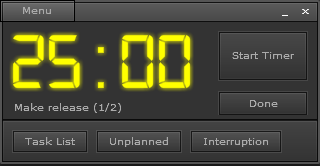
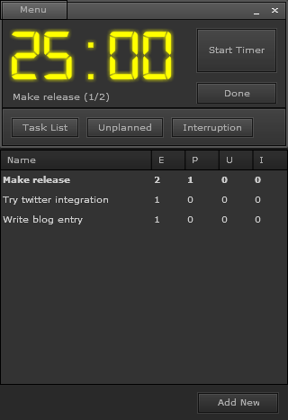

This project was exported from code.google.com/p/pomodairo

#Pomodairo

An Adobe Air application for working with the Pomodoro technique, http://www.pomodorotechnique.com.

Pomodairo includes the obligatory timer of course, but also includes a task list for the pomodoros. The application keeps track of pomodoros, unplanned and interruptions during the day.

## Screenshots

Pomodairo Client mini view (version 1.9):

Pomodairo Client (version 1.7):

Pomodairo Client with tasklist (version 1.7): 

## Installation

*  Install Adobe AIR runtime
* Download and install Pomodairo.air

Feedback is very much appreciated! Please click on the Issue tab to report bugs and/or provide feature-requests.

The current version is 1.9. Please see the release notes below if you are upgrading from an older version.

## Questions?

There is an FAQ page started here. Check the wiki-pages here. Or you can use the forums found here.

## Donations for original developers

Pomodairo is freeware and will remain free. However if you find Pomodairo useful then consider making a donation. Thank you!

https://www.paypal.com/se/cgi-bin/webscr?cmd=_flow&SESSION=L7B65nS4ECSqGBf0WDIrmpLb9njmbm69nFaNmCGHV9v1yxKtPtwgaivZJ_S&dispatch=5885d80a13c0db1f8e263663d3faee8d99e4111b56ef0eae45e68b8988f5b2dd

## Release Notes

### Version 1.9

* Added support for custom sounds
* Added support for arrange task order
* Added break time configuration
* Reworked the menu and config system 

### Version 1.8

* Added config for continuous ticking sound
* Fixed Twitter OAuth authentication - More info here
* Set location of database, enables computer synchronization
* Fix for duration when in timezones with +-xx:30
* Added miniview that can be toggled on/off 

### Version 1.7

* Cleaned up GUI
* Added menu
* Added right-click menu in task list
* Added edit task functionality
* Added experimental Twitter integration 

### Version 1.6

* Added statistics, contributed by Jochen
* Added direct done and next button, contributed by Jochen
* Added URL mapping of tasks with hashcode (#), contributed by Jochen
* Fixed bug when resolution is changed ( issue #30 )
* Minor graphical and UI updates 

### Version 1.5

* Setting close date for done tasks
* Added ability to copy name of the pomodoro to clipboard
* Pomodoro and timer now shows in taskbar. Can be turned off in configuration.
* Pomodoros are only counted when timer completes.
* Configuration option to keep window on top.
* Deleted pomodoros that are running will be stopped and cleared.
* Made visual notification for time out more distinct.
* Added a refresh button to DatabaseViewer 

### Version 1.4

* Added persisted configuration for sound, volume and time per Pomodoro
* The application now remember the position on the screen between restarts
* Fixed flashing tool tip on 'Done' button 

### Version 1.3

NOTE: This is the first release using auto-update, please report any issues with the updater asap!

* Fixed a bug where the break timer would not stop
* Added blinking of the counter when it reaches 00:00
* Some minor design enhancement 

### Version 1.2

* Added automatic updates for future releases.
* Removed 'start' button in tasklist.
* Added a sound on/off toggle icon 

### Version 1.1

NOTE: 1.1 is not backwards compatible with the 1.0 database. All your tasks in the 1.0 database will be lost when you upgrade to v1.1

* Added a 'Clean' functionality in the task list. Clean removes all items that are 'done'.
* Added breaks. A break will be started automatically 5 seconds after the pomodoro ends and will keep counting until the break is stopped.
* Added coloration. The timer will be red when there is less than one minute remaining. Breaks will be green.
* Plus some more minor tweaks =) 
